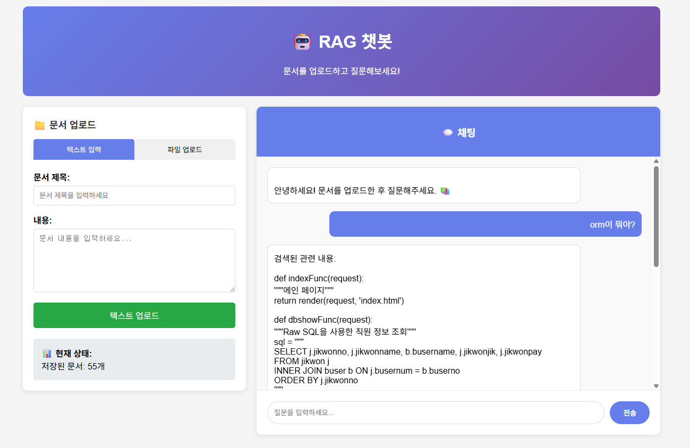

# RAG 챗봇 (Django)

Django 기반의 Retrieval-Augmented Generation (RAG) 챗봇 시스템입니다. 문서를 업로드하고 내용에 기반한 질문응답을 할 수 있습니다.



## 🌟 주요 기능

- **문서 업로드**: PDF, TXT, DOCX 파일 지원
- **텍스트 직접 입력**: 브라우저에서 바로 문서 추가
- **실시간 채팅**: AJAX 기반 즉시 응답
- **키워드 검색**: 업로드된 문서에서 관련 내용 검색
- **반응형 UI**: 깔끔하고 사용하기 쉬운 인터페이스

## 🚀 빠른 시작

### 사전 요구사항
- Python 3.8+
- Django 4.0+

### 설치 및 실행

1. **프로젝트 클론**
```bash
git clone https://github.com/username/django-rag-chatbot.git
cd django-rag-chatbot
```

2. **가상환경 생성 및 활성화**
```bash
python -m venv venv
source venv/bin/activate  # Windows: venv\Scripts\activate
```

3. **필요한 패키지 설치**
```bash
pip install -r requirements.txt
```

4. **데이터베이스 마이그레이션**
```bash
python manage.py makemigrations
python manage.py migrate
```

5. **서버 실행**
```bash
python manage.py runserver
```

6. **브라우저에서 접속**
```
http://127.0.0.1:8000/
```

## 📦 패키지 목록

```txt
Django==4.2.0
langchain==0.3.27
langchain-community==0.3.74
langchain-text-splitters==0.3.9
pypdf==4.0.0
python-docx==1.2.0
scikit-learn==1.7.1
```

## 🏗️ 프로젝트 구조

```
django_rag_chatbot/
├── manage.py
├── mainapp/
│   ├── settings.py
│   ├── urls.py
│   └── wsgi.py
├── chatbot/
│   ├── models.py          # 문서 모델
│   ├── views.py           # API 뷰
│   ├── urls.py            # URL 라우팅
│   ├── rag_engine.py      # RAG 엔진 로직
│   └── migrations/
├── templates/
│   └── chatbot/
│       └── chatbot.html   # 프론트엔드 UI
├── media/
│   └── documents/         # 업로드된 파일 저장
└── requirements.txt
```

## 🔧 주요 컴포넌트

### RAG 엔진 (`chatbot/rag_engine.py`)
- **문서 처리**: PDF, TXT, DOCX 파일을 청크 단위로 분할
- **키워드 검색**: 간단하지만 효과적인 키워드 매칭 알고리즘
- **응답 생성**: 관련 문서를 기반으로 컨텍스트 제공

### API 엔드포인트
- `POST /api/chat/` - 채팅 메시지 처리
- `POST /api/upload-text/` - 텍스트 직접 업로드
- `POST /api/upload-file/` - 파일 업로드

### 모델 (`chatbot/models.py`)
```python
class Document(models.Model):
    title = models.CharField(max_length=200)
    file = models.FileField(upload_to='documents/')
    text_content = models.TextField()
    uploaded_at = models.DateTimeField(auto_now_add=True)
    processed = models.BooleanField(default=False)
    chunk_count = models.IntegerField(default=0)
```

## 💡 사용 방법

### 1. 문서 업로드
- **텍스트 입력**: 제목과 내용을 직접 입력
- **파일 업로드**: PDF, TXT, DOCX 파일 선택하여 업로드

### 2. 질문하기
- 채팅창에 질문 입력
- 업로드된 문서에서 관련 내용을 찾아 응답

### 3. 예시 사용 케이스
```
1. 회사 매뉴얼 업로드 → "휴가 신청 방법은?"
2. 기술 문서 업로드 → "API 인증은 어떻게 해?"
3. 학습 자료 업로드 → "머신러닝의 정의는?"
```

## 🔍 기술 스택

- **백엔드**: Django, Python
- **프론트엔드**: HTML, CSS, JavaScript (Vanilla)
- **문서 처리**: LangChain, PyPDF, python-docx
- **검색**: 키워드 기반 매칭 (scikit-learn TF-IDF)
- **데이터베이스**: SQLite (개발용)

## 🚧 개발 로드맵

### v1.0 (현재)
- [x] 기본 문서 업로드
- [x] 키워드 기반 검색
- [x] 웹 인터페이스

### v2.0 (계획)
- [ ] 벡터 데이터베이스 연동 (ChromaDB/Pinecone)
- [ ] 임베딩 기반 의미 검색
- [ ] LLM API 연동 (OpenAI/Claude)
- [ ] 사용자 인증 시스템

### v3.0 (계획)
- [ ] MCP (Model Context Protocol) 지원
- [ ] Claude Desktop 연동
- [ ] 멀티모달 지원 (이미지, 오디오)
- [ ] 실시간 협업 기능

## 🤝 기여하기

1. Fork the Project
2. Create your Feature Branch (`git checkout -b hyenaempress/Rag_std`)
3. Commit your Changes (`git commit -m 'Add some Rag_std`)
4. Push to the Branch (`git push origin hyenaempress/Rag_std`)
5. Open a Pull Request

## 📋 개발 가이드

### 로컬 개발 환경 설정
```bash
# 개발용 설정
DEBUG = True
ALLOWED_HOSTS = ['127.0.0.1', 'localhost']

# 개발용 패키지 추가 설치
pip install django-debug-toolbar
```

### 테스트 실행
```bash
python manage.py test
```

### 정적 파일 수집 (배포시)
```bash
python manage.py collectstatic
```

## 🐛 알려진 이슈

- PDF 파일 처리시 한글 깨짐 현상 (pypdf 한계)
- 대용량 파일 업로드시 메모리 사용량 증가
- 복잡한 문서 구조 처리 한계

## 📞 문의 및 지원

- **Email**: catnaro16@gmail.com

## 📄 라이선스

이 프로젝트는 MIT 라이선스 하에 있습니다. 자세한 내용은 [LICENSE](LICENSE) 파일을 참조하세요.

## 🙏 감사의 말

- [LangChain](https://github.com/langchain-ai/langchain) - 문서 처리 프레임워크
- [Django](https://www.djangoproject.com/) - 웹 프레임워크
- [scikit-learn](https://scikit-learn.org/) - 머신러닝 라이브러리

---

⭐ 이 프로젝트가 도움이 되었다면 스타를 눌러주세요!