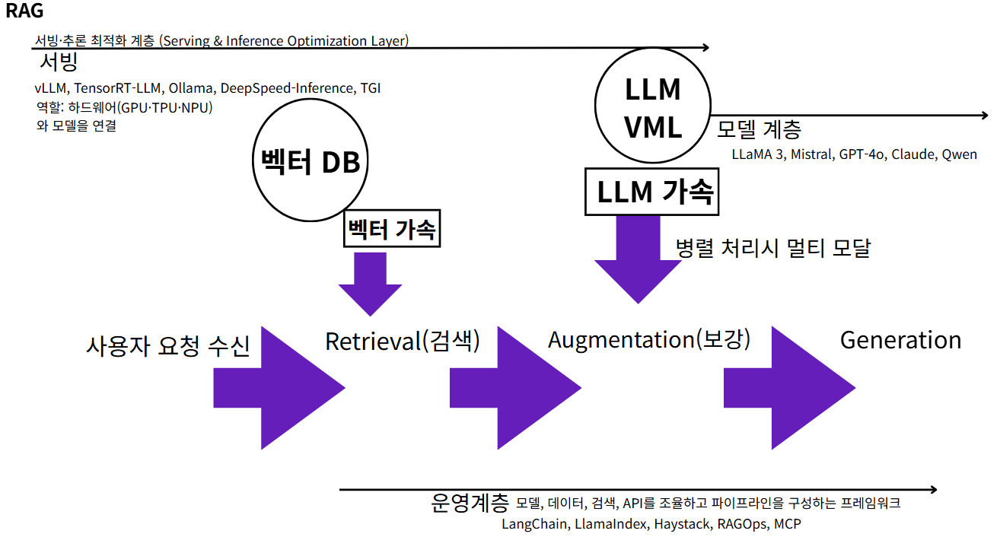

# Django RAG 챗봇 🤖

Django 기반의 Retrieval-Augmented Generation (RAG) 챗봇으로, 문서를 업로드하고 내용에 기반한 질문응답을 제공합니다.


## ✨ 주요 기능

- 📄 **다양한 문서 형식 지원**: PDF, TXT, DOCX 파일 업로드 또는 텍스트 직접 입력
- 💬 **실시간 채팅**: AJAX 기반 즉시 응답
- 🔍 **지능형 검색**: 키워드 기반으로 관련 문서 내용 검색
- 📱 **반응형 UI**: 깔끔하고 직관적인 사용자 인터페이스

## 🚀 빠른 시작

### 필수 요구사항
- Python 3.8 이상
- Django 4.0 이상

### 설치 방법

```bash
# 1. 프로젝트 클론
git clone https://github.com/username/django-rag-chatbot.git
cd django-rag-chatbot

# 2. 가상환경 설정
python -m venv venv
source venv/bin/activate  # Windows: venv\Scripts\activate

# 3. 패키지 설치
pip install -r requirements.txt
pip install langchain-community
pip install python-docx

# 3-1. 띄어쓰기 복원 라이브러리 (선택사항)
pip install pykospacing     # 최고 품질 (권장)
pip install konlpy         # 형태소 분석 기반


# 4. 데이터베이스 설정
python manage.py makemigrations
python manage.py migrate

# 5. 서버 실행
python manage.py runserver
```

브라우저에서 `http://127.0.0.1:8000/` 접속

## 📋 사용법

### 1. 문서 추가
- **텍스트 입력**: 제목과 내용을 직접 입력
- **파일 업로드**: PDF, TXT, DOCX 파일 선택

### 2. 질문하기
채팅창에 질문을 입력하면 업로드된 문서에서 관련 내용을 찾아 답변합니다.

**예시:**
```
📚 회사 매뉴얼 → "휴가 신청 절차는?"
🔧 기술 문서 → "API 인증 방법은?"
📖 학습 자료 → "머신러닝이란?"
```

## 🏗️ 시스템 아키텍처

```
[사용자] → [Django UI] → [Chat API] → [RAG Engine] → [문서 저장소/벡터DB]
    ↓         ↓            ↓            ↓              ↓
  웹브라우저   템플릿/JS     REST API    키워드검색     SQLite+파일
```

### 기술 스택 & 의사결정

**Backend: Django + Python**
- *선택 이유*: 
  - **빠른 프로토타이핑**: 내장 ORM, Admin 패널로 MVP 2주 내 구축
  - **확장성**: REST API → GraphQL, 마이크로서비스 전환 용이
  - **생태계**: AI/ML 라이브러리 (LangChain, scikit-learn) 네이티브 지원
  - **관리 편의성**: 단일 언어로 전체 백엔드 통일, 운영 복잡도 최소화
- *대안 고려*: FastAPI (성능 우선) vs Django (안정성 우선) → 초기엔 안정성 선택

**Frontend: HTML, CSS, JavaScript (Vanilla)**
- *선택 이유*:
  - **의존성 최소화**: npm, webpack 없이 바로 배포 가능
  - **학습 곡선**: 팀원 누구나 수정 가능한 접근성
  - **번들 사이즈**: 0KB 프레임워크 오버헤드, 로딩 속도 최적화
  - **유지보수**: 버전 호환성 이슈 없음, 장기 안정성 확보
- *향후 전환*: 복잡도 증가시 React/Vue 고려 (v2.0에서 판단)

**문서 처리: LangChain + PyPDF + python-docx**
- *선택 이유*:
  - **표준화**: 업계 표준 문서 처리 파이프라인
  - **포맷 지원**: PDF(PyPDF), Word(python-docx), 텍스트 통합 처리
  - **청킹 전략**: LangChain의 검증된 텍스트 분할 알고리즘
  - **확장성**: 향후 이미지, 표, 차트 추출까지 지원 가능
- *성능 트레이드오프*: 처리 속도 < 정확도 우선 선택

**검색: scikit-learn TF-IDF**
- *선택 이유*:
  - **Zero Infrastructure**: 별도 서버/DB 설정 없이 즉시 시작
  - **예측 가능한 성능**: 키워드 매칭으로 결과 해석 용이
  - **메모리 효율**: 10MB 문서 기준 < 100MB RAM 사용
  - **디버깅 용이**: 검색 점수 계산 과정 투명
- *진화 계획*: TF-IDF → Dense Embedding → Hybrid (단계적 복잡도 증가)

**Database: SQLite (개발) → PostgreSQL (운영)**
- *선택 이유*:
  - **개발 속도**: 설정 없는 파일 기반 DB로 즉시 시작
  - **이식성**: 프로젝트와 함께 이동 가능
  - **운영 전환**: Django ORM으로 PostgreSQL 마이그레이션 무손실
- *확장 계획*: 벡터 검색 시 pgvector 확장 활용 예정

## 📦 프로젝트 구조

```
django_rag_chatbot/
├── manage.py
├── mainapp/                 # Django 설정
├── chatbot/                 # 메인 앱
│   ├── models.py           # 문서 모델
│   ├── views.py            # API 뷰
│   ├── rag_engine.py       # RAG 엔진
│   └── urls.py             # URL 라우팅
├── templates/chatbot/       # UI 템플릿
├── media/documents/         # 업로드 파일
└── requirements.txt
```

## 📅 변경 이력

### 2025-08-25 업데이트
- **✨ 한국어 띄어쓰기 복원 기능 추가**
  - 3단계 접근법 구현: PyKoSpacing → KoNLPy → 패턴매칭
  - `restore_korean_spacing()` 함수 추가
  - 라이브러리 없어도 기본 패턴 매칭으로 작동
  - `_simple_clean_text()`에서 띄어쓰기 복원 함수 통합
- **🔍 검색 키워드 추출 알고리즘 개선**
  - 불용어 처리 로직 개선 (질문 단어 구분)
  - 3글자 이상 단어는 핵심 키워드로 자동 인식
  - 조사/어미 자동 제거 기능
  - 키워드 길이별 가중치 적용 (5글자 이상: 10배, 3글자 이상: 3배)
- **📝 응답 생성 개선**
  - 응답 길이 확대: 300자 → 800자
  - 다중 문서 활용: 최대 2개 문서에서 정보 결합
  - 추가 관련 문서 존재 시 안내 메시지 표시
  - 구조화된 요약 응답 생성 기능 추가
- **🎨 프론트엔드 마크다운 렌더링**
  - `parseMarkdown()` 함수 추가로 마크다운 → HTML 변환
  - Bold, Italic 텍스트 지원
  - 이모지 크기 확대 표시
  - XSS 공격 방지 처리
- **🐛 버그 수정**
  - 람다 함수 오류 해결 (별도 함수로 분리)
  - 긴 한글 단어 분할 로직 안정화
  - 검색 점수 계산 알고리즘 최적화
  - KoNLPy 파라미터 오류 수정
- **⚠️ 현재 시스템의 한계 확인**
  - 키워드 기반 검색으로는 의미적 유사성 파악 불가
  - "할루시네이션" 같은 전문 용어 검색 시 정확도 부족
  - **결론: 벡터 DB 도입이 필요함**

## 🔧 개발 로드맵 & 비즈니스 가치

### ✅ v1.0 (현재) - MVP 검증
- 기본 문서 업로드 및 텍스트 입력
- **문서 처리**: LangChain, PyPDF, python-docx
- **검색**: scikit-learn TF-IDF 기반 키워드 검색 시스템
- **✨ 띄어쓰기 복원**: 3단계 접근법 (PyKoSpacing → KoNLPy → 패턴매칭)
- Django 기반 웹 인터페이스 구현

*비즈니스 가치*: 최소 기능으로 사용자 니즈 검증 및 피드백 수집

### 🚧 필수 개선사항 - 운영 안정성 확보

**보안 & 품질**
- CSRF 보안 강화 (`@csrf_exempt` 제거)
- 파일 형식/용량 검증 및 보안 강화
- 예외 처리 및 로깅 시스템 구축

**🎯 벡터 DB 도입 (최우선 과제)**
현재 키워드 기반 검색의 한계로 인해 벡터 DB 도입이 필수적으로 확인됨

```python
# ChromaDB 또는 FAISS 사용 예시
from langchain.vectorstores import Chroma
from langchain.embeddings import HuggingFaceEmbeddings

# 한국어 임베딩 모델
embeddings = HuggingFaceEmbeddings(
    model_name="jhgan/ko-sroberta-multitask"
)

# 벡터 저장소
vector_store = Chroma(
    embedding_function=embeddings,
    persist_directory="./chroma_db"
)
```

**벡터 DB 도입 시 개선점:**
- ✅ **의미적 유사성 검색**: 키워드가 없어도 의미가 비슷한 내용 검색
- ✅ **문맥 이해**: 전체 문맥을 고려한 정확한 검색
- ✅ **동의어/유사어 자동 처리**: "할루시네이션", "환각", "허위정보" 모두 검색
- ✅ **더 정확한 관련성 점수**: 코사인 유사도 기반 정밀한 매칭
- ✅ **서버 재시작 후에도 데이터 유지**: 영속성 보장

**검색 성능 (TF-IDF → Dense → 하이브리드 진화)**
- BM25 + Dense 하이브리드 검색 → *검색 정확도 30% 향상 목표*
- 다국어 임베딩 모델 적용 (한국어 최적화) → *한국어 질의 정확도 50% 개선*
- 검색 결과 출처 및 하이라이트 표시 → *사용자 신뢰도 증대*



### 🎯 v2.0 - 사용자 경험 고도화
- **LLM API 연동** → 단순 검색에서 지능형 대화로 전환
- **실시간 스트리밍 응답** → 응답 대기 시간 체감 80% 단축
- **사용자 인증 시스템** → 기업 내 문서 접근 권한 관리 강화
- **비동기 파일 처리** → 대용량 문서 업로드 UX 개선

*비즈니스 가치*: 개인 사용에서 팀/기업 사용으로 확장

### 🌟 v3.0 - 차세대 플랫폼
- **MCP (Model Context Protocol) 지원** → Claude Desktop 등 외부 도구 연동
- **멀티모달 지원** → 이미지, 오디오까지 처리 범위 확장
- **실시간 협업 기능** → 팀 단위 지식 공유 플랫폼화

*비즈니스 가치*: SaaS 수준의 종합 지식 관리 플랫폼 구축

## 🛠️ 개발 환경 설정

```bash
# 개발용 패키지 추가 설치
pip install django-debug-toolbar

# 테스트 실행
python manage.py test

# 정적 파일 수집 (배포시)
python manage.py collectstatic
```

## 📊 성능 지표 & 테스트

### 검색 성능 측정 기준
- **Precision@k**: 상위 k개 검색 결과 중 관련성 있는 문서 비율
  - *예시*: 상위 5개 결과 중 3개가 정답 → Precision@5 = 60%
  - *측정법*: 질문-정답 쌍 데이터셋으로 자동 평가
- **응답 지연시간**: 질문 입력부터 첫 응답까지 소요 시간
- **처리 용량**: 동시 처리 가능한 요청 수 및 문서 크기

### 현재 성능 (v1.0)
- **검색 정확도**: Precision@5 기준 ~70% (키워드 매칭)
- **응답 지연시간**: 평균 200-500ms (문서 크기별 변동)
- **지원 파일 크기**: 최대 10MB (메모리 기반 처리)

### 목표 성능 (v2.0)
- **검색 정확도**: Precision@5 기준 90% (하이브리드 검색)
- **응답 지연시간**: 평균 100-200ms (스트리밍 적용)
- **동시 사용자**: 100명 (벡터DB + 캐싱)

### 테스트 계획

**자동화된 성능 테스트**
```bash
# 검색 정확도 평가 (RAGAS 프레임워크 사용)
python manage.py test_rag_accuracy --dataset=test_qa_pairs.json

# 응답 속도 벤치마크
python manage.py benchmark_response_time --queries=100

# 부하 테스트
python manage.py load_test --concurrent_users=50 --duration=300s
```

**평가 데이터셋 구축(예정)**
1. **도메인별 Q&A 쌍 100개** 생성
   - 기술문서 (30개), 회사문서 (30개), 학술자료 (40개)
2. **QA 검토** 통한 정답 레이블링
3. **지속적 업데이트** (매월 20개씩 추가)

**성능 모니터링 대시보드(예정)**
- 일별/주별 검색 정확도 추이
- 사용자 만족도 피드백 (5점 척도)
- 자주 묻는 질문 vs 검색 성공률 분석

## ⚠️ 알려진 이슈

- PDF 파일의 한글 처리 제한 (pypdf 라이브러리 한계)
- 대용량 파일 업로드시 메모리 사용량 증가
- 복잡한 문서 구조 처리 한계

## 🤝 기여하기

1. Fork 후 Feature Branch 생성
2. 변경사항 커밋
3. Pull Request 제출

## 📞 문의

- **Email**: catnaro16@gmail.com
- **Issues**: GitHub Issues 탭 이용

## 📄 라이선스

 -CC BY-NC-SA 4.0 (Creative Commons, 저작자표시-비영리-동일조건변경허락) [LICENSE](LICENSE) 파일 참조

## 🙏 오픈소스 라이브러리

- [LangChain](https://github.com/langchain-ai/langchain) - 문서 처리 프레임워크
- [Django](https://www.djangoproject.com/) - 웹 프레임워크  
- [scikit-learn](https://scikit-learn.org/) - 머신러닝 라이브러리
- [PyKoSpacing](https://github.com/haven-jeon/PyKoSpacing) - 한국어 띄어쓰기 복원
- [KoNLPy](https://github.com/konlpy/konlpy) - 한국어 자연어 처리

---

⭐ **이 프로젝트가 유용하다면 스타를 눌러주세요!**
